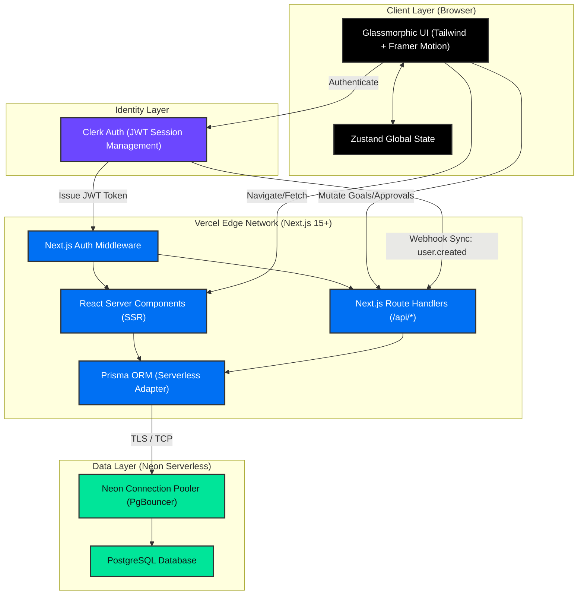

# 🏆 AtomQuest Hackathon Submission: GoalForge

**Project Name:** GoalForge
**Category:** Enterprise Performance & Goal Management System

---

## 🔗 1. Working Link
**Live Production URL:** [https://atom-quest-hackathon-goal-forge.vercel.app](https://atom-quest-hackathon-goal-forge.vercel.app)

*(Note: The platform utilizes Clerk for authentication. Feel free to sign up securely to test the Employee/Manager dashboards).*

---

## 💻 2. Source Code Repository
**GitHub Repository:** [https://github.com/abi-shek-dev/AtomQuest_Hackathon_GoalForge](https://github.com/abi-shek-dev/AtomQuest_Hackathon_GoalForge)

*(The repository contains a highly detailed enterprise-grade `README.md` explaining the deep technical implementation of the project).*

---

## 🏗️ 3. Architecture Diagram

GoalForge utilizes a bleeding-edge serverless architecture. The diagram below maps the data flow from the client, through authentication, down to our edge database pooler.

---

### Architecture Overview:
1. **Client Layer:** Renders a premium, responsive glassmorphic UI. Zustand handles ephemeral client state.
2. **Identity Layer:** Clerk intercepts logins, managing JWT cookies and offloading security liability.
3. **Server Layer:** Hosted on Vercel. Next.js Middleware protects routes. Server Components fetch data instantly without loading spinners. Route Handlers process business logic (approvals, quarter checks). Prisma handles type-safe database mutations.
4. **Data Layer:** Hosted on Neon Serverless Postgres. The Prisma Client connects through Neon's built-in PgBouncer pooler to prevent connection exhaustion in the serverless environment.
